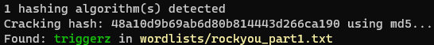

# Brute

Brute est un petit script python qui permet de repérer le type de mot de passe et d'essayer de le cracker.

Il n'est pas très avancé, il va simplement essayer de repérer le type de mot de passe avec une expression régulière, et si un match est fait, tous les mots de passes contenus dans les fichiers qui sont dans le repertoire `wordlists` seront essayés.

## Chiffrements supportés

- MD5
- SHA1
- SHA256
- SHA512
- SHA2
- BCRYPT


## Installation

Pour l'installer, il suffit de cloner le dépôt git et d'installer les dépendances.

```bash
git clone https://github.com/davidtchilian/brute.git
cd brute
pip3 install -r requirements.txt
```

## Utilisation

Pour l'utiliser, il suffit de lancer le script avec python3 et de lui passer en paramètre le mot de passe à tester.

```bash
python3 brute.py 48a10d9b69ab6d80b814443d266ca190
```



## Ajouter des wordlists

Pour ajouter des wordlists, il suffit de les mettre dans le dossier `wordlists` et de les nommer comme vous le souhaitez.


## License

[MIT](https://choosealicense.com/licenses/mit/)


